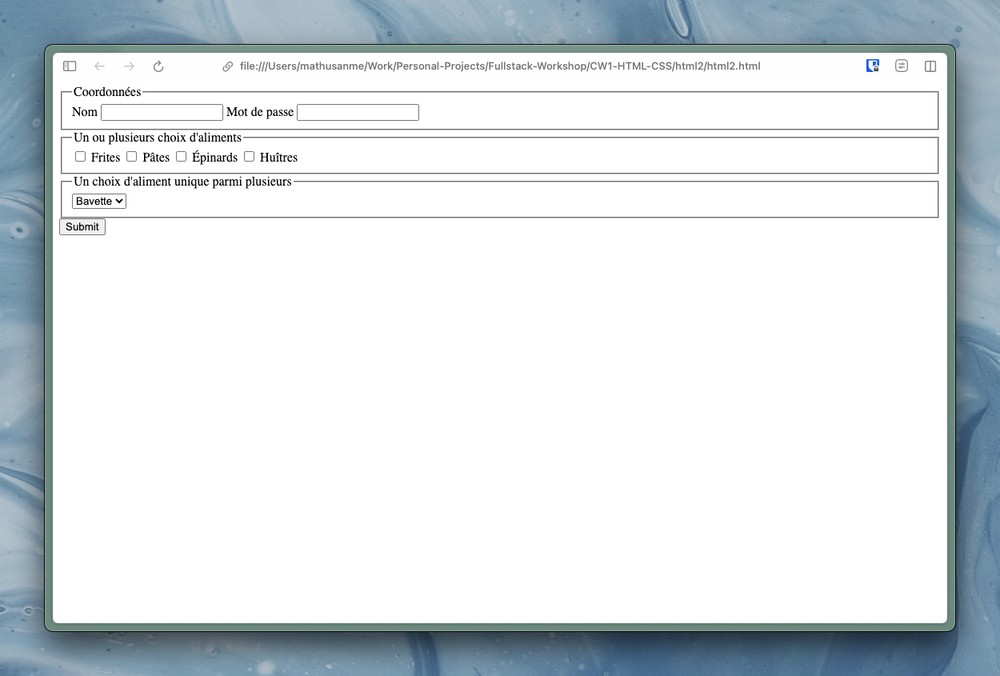
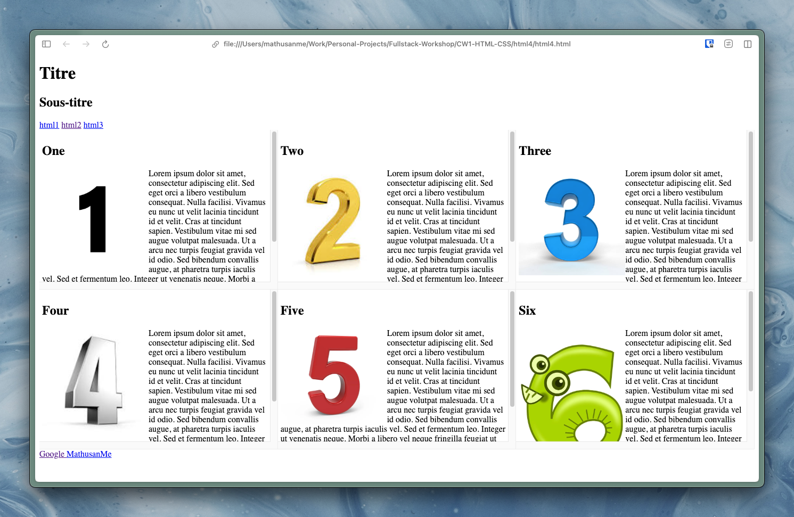
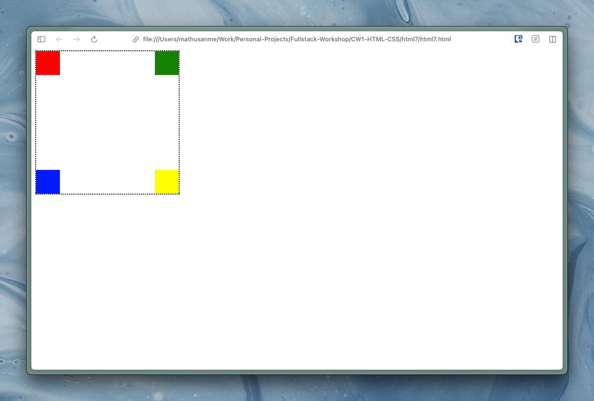
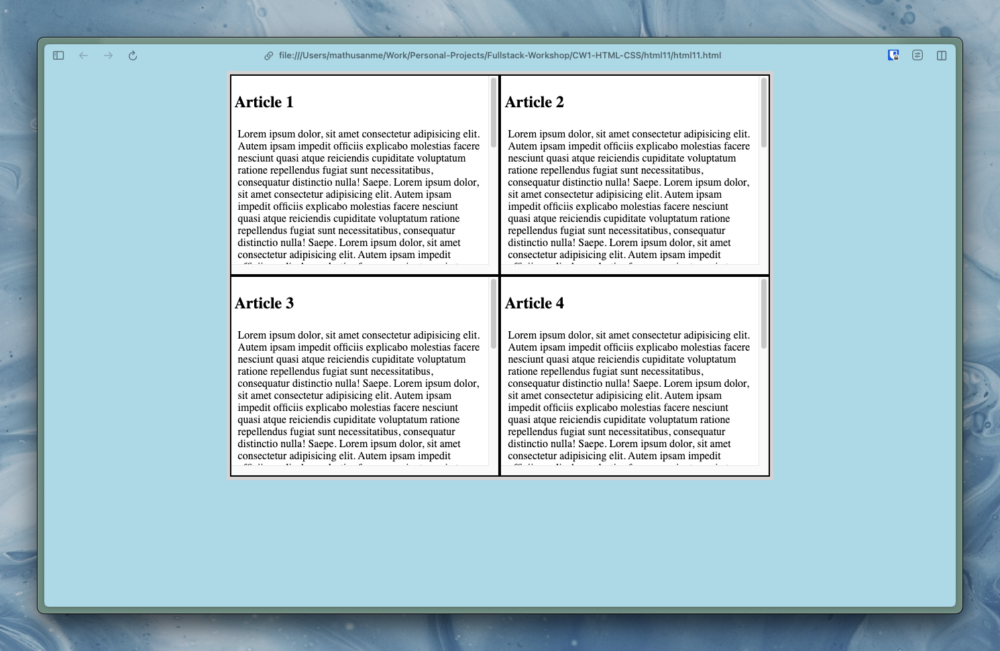

# Coursework 1: HTML and CSS
## Description
This coursework contains mini-exercises to practice HTML and CSS. Here are some examples of what I have created:

  
   
  Form

 

  
   
  Grid

 

  
   
  Positioning

 

  
   
  Advanced Grid

