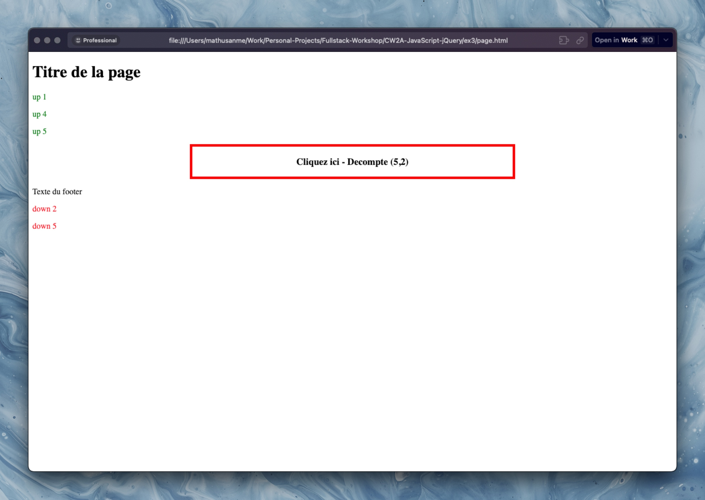
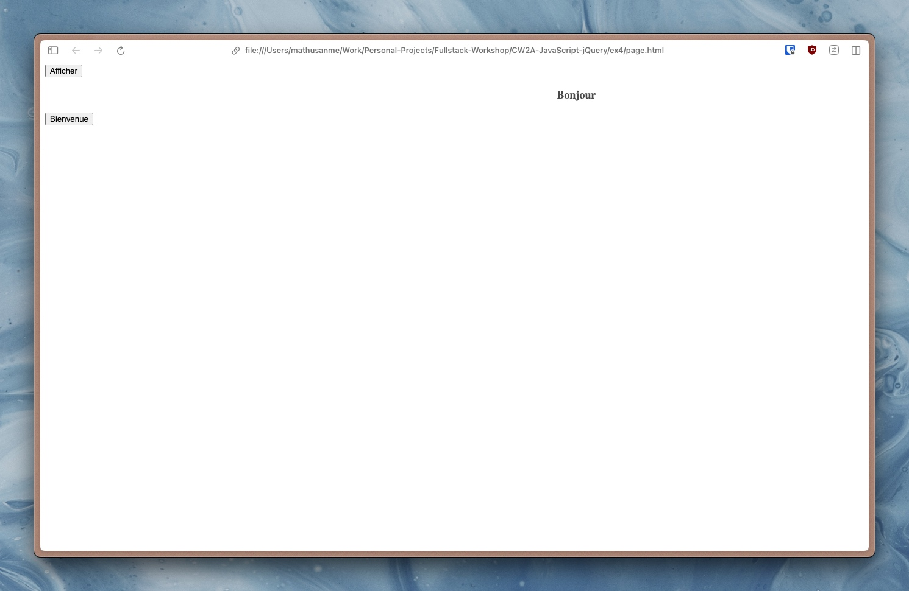
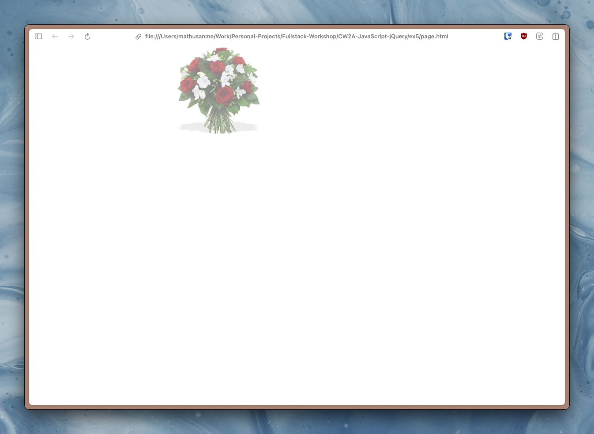

# Coursework 2A: JavaScript and jQuery
## Description
This coursework is the first part of two courseworks containing mini-exercises to practice JavaScript and jQuery. Here are some examples of what I have created:

  
   
  Divs and Texts

 

  
   
  Slide Toggle and Animate

 

  
   
  Slideshow

