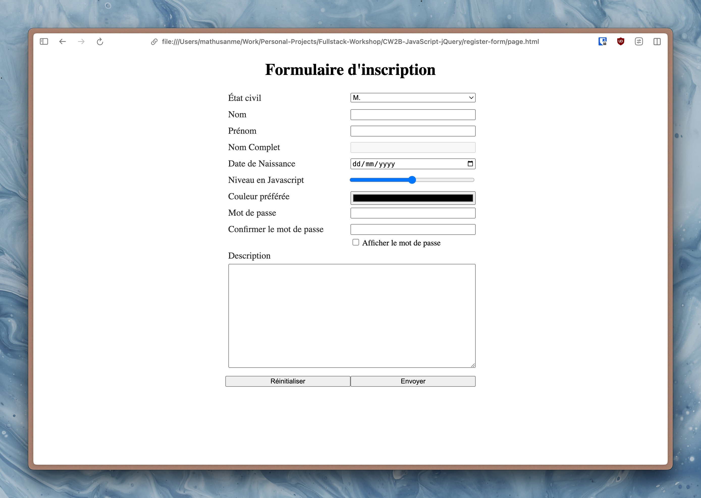
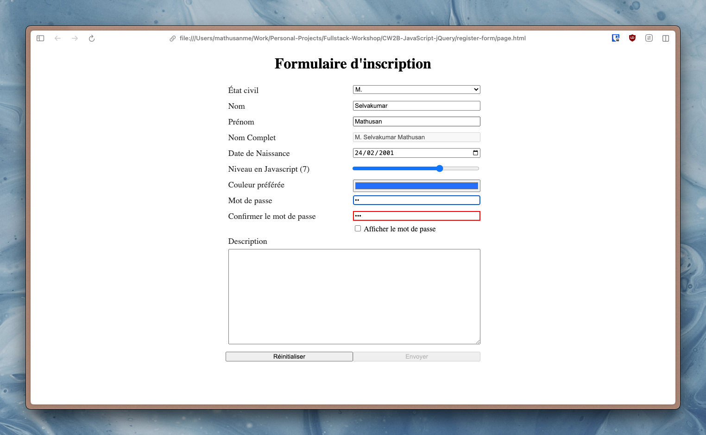
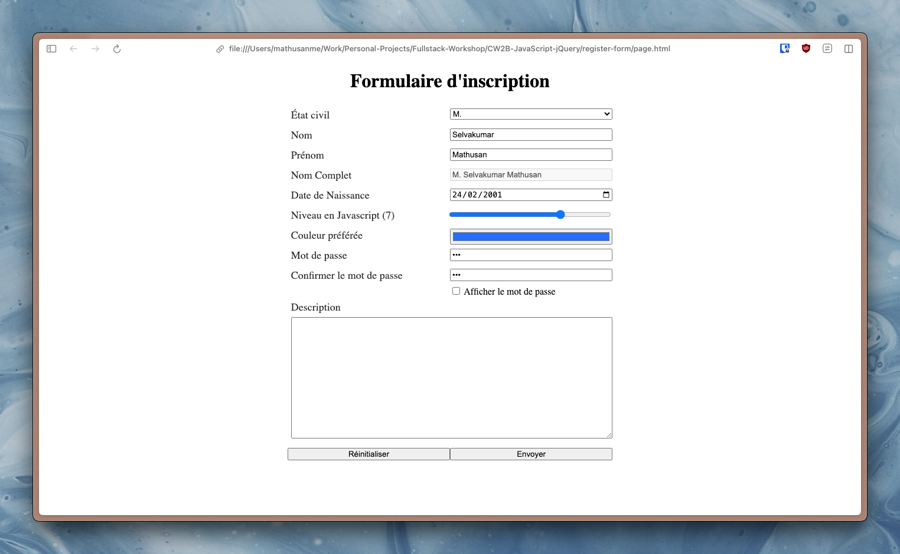
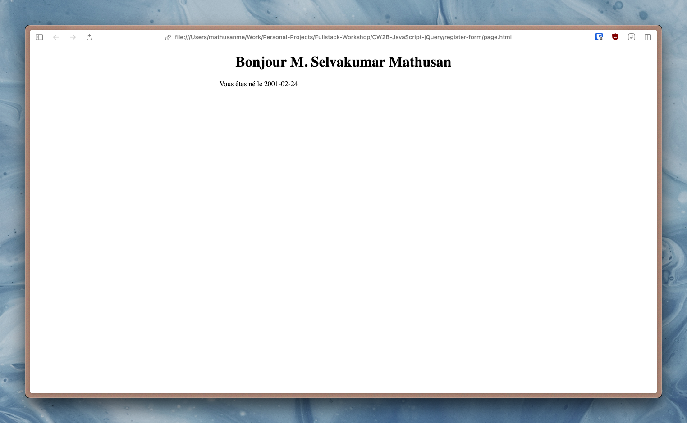

# Coursework 2B: JavaScript and jQuery
## Description
This coursework is the second part of two courseworks containing mini-exercises to practice JavaScript and jQuery. Here are some examples of what I have created:

  
   
  Registration Form

 

  
   
  Registration Form

 

  
   
  Registration Form

 

  
   
  Page after validating form

