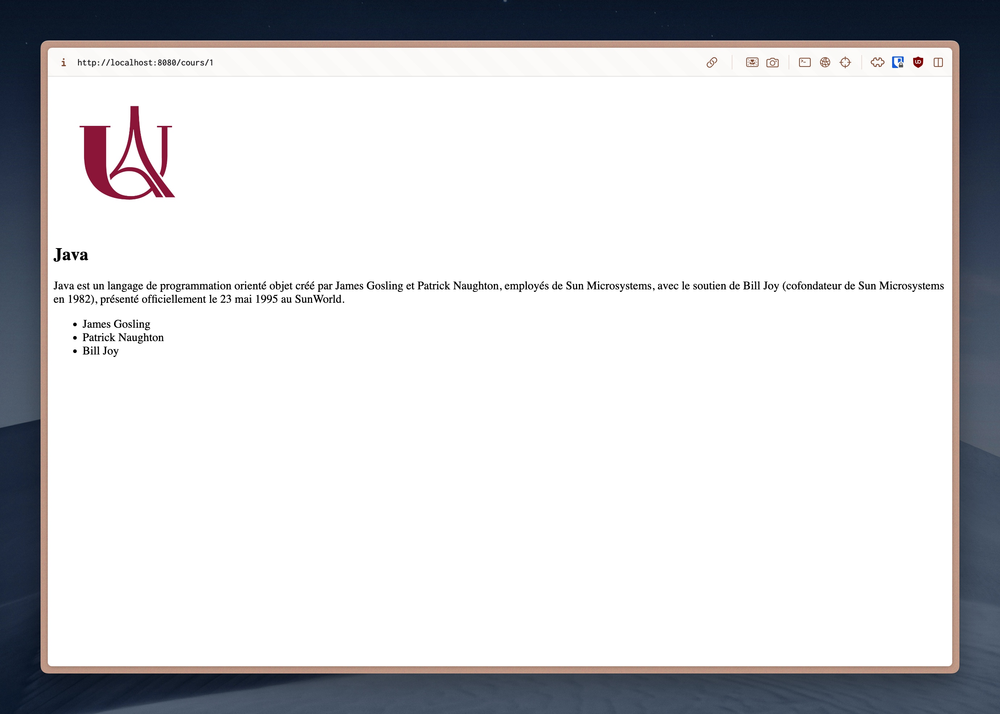

# Coursework 3A: Server Side Development with Node.js
## Description
This coursework is the first part of two courseworks containing mini-exercises to practice server-side development with Node.js. Here are some examples of what I have created:

  
   
  Routing

