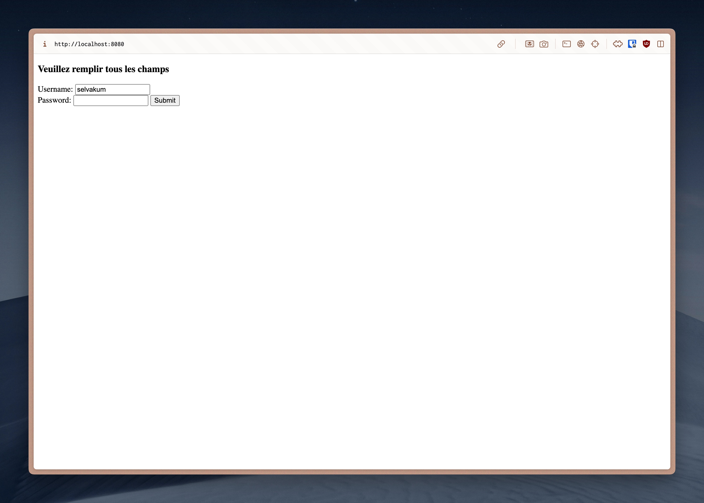
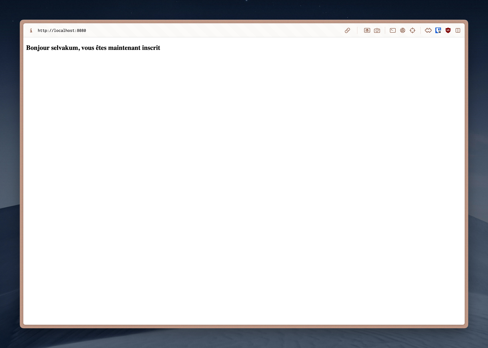
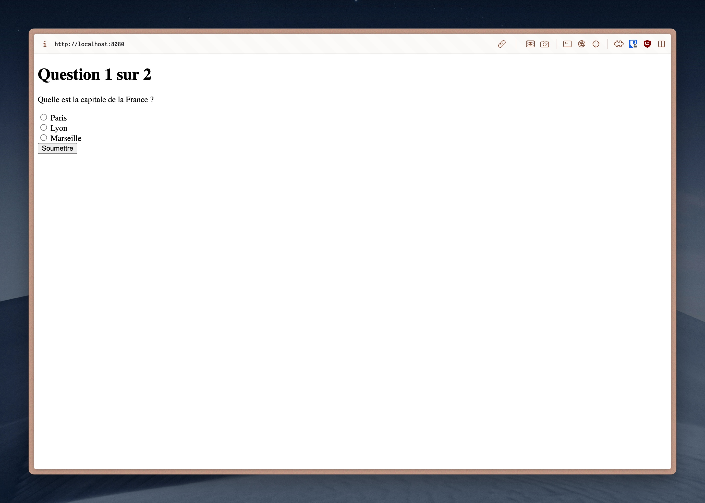

# Coursework 3B: Server Side Form with Express
## Description
This coursework is the second part of two courseworks containing mini-exercises to practice server-side development with Express and Embedded Javascript. Here are some examples of what I have created:

### Registration Form

  
   
  Registration Form

 

  
   
  Missing Fields

 

  
   
  New Registration

 

  
   
  Password Change

### Quiz

  
   
  Quiz

