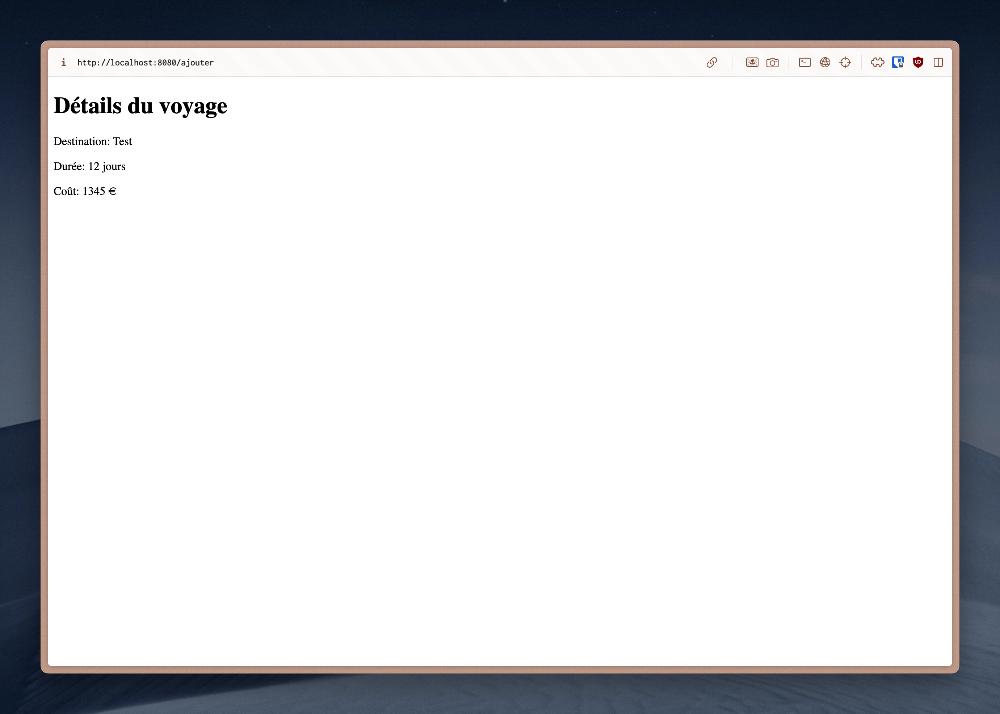

# Coursework 5: Practical Exam
## Description
This coursework is a practical exam containing mini-exercises to practice server-side development with Node.js and Express. Here are some examples of what I have created:

### HTML/CSS/JQuery

  
   
  Image Gallery

### Node/Express/Embedded Javascript

  
   
  Add a Trip

 

  
   
  Added Trip

 

  
   
  All Trips

